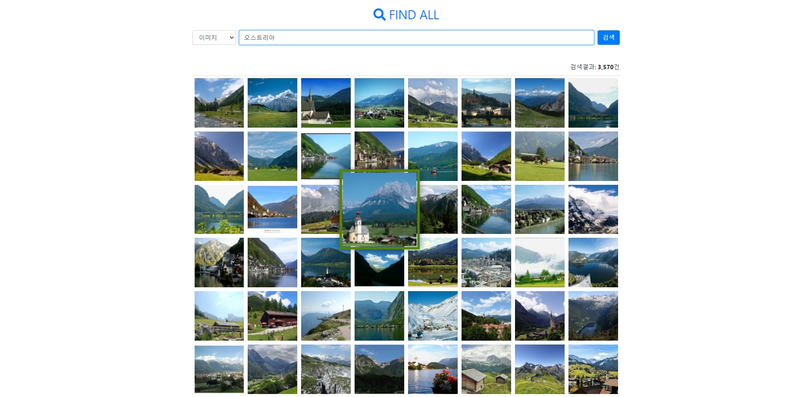
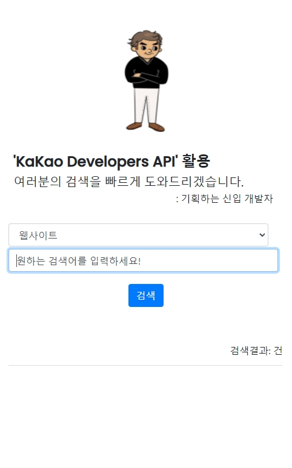
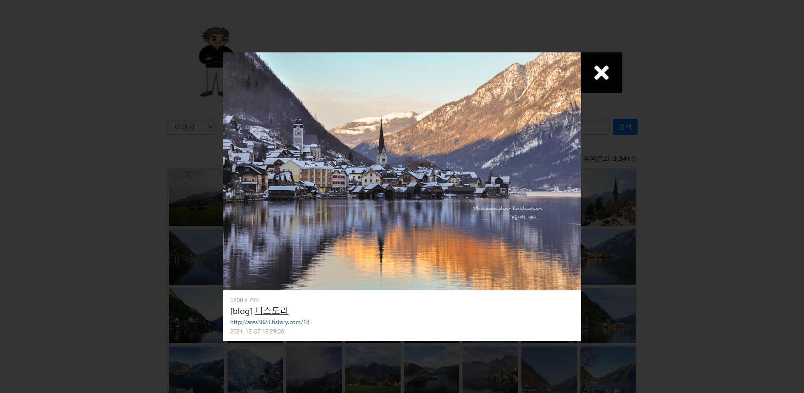
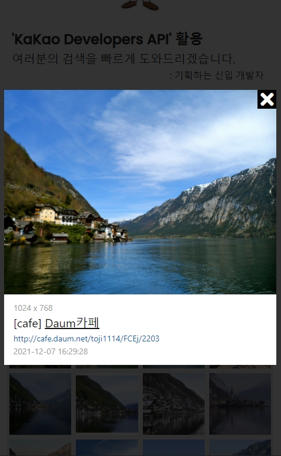

# [Kakao API 활용 검색포털](https://kakao-search.web.app)

# 1. 프로젝트 개요

## - 교육 과정 프로젝트 : 참여율 100%

## - 해당 Node 프로젝트 자체 이해도 80%

## - Only JavaScript 활용 개발(ES5)

---

# 2. 프로젝트 방향

## - 교육과정 프로젝트(+고도화)

## - CSS 클론코딩 이후 처음 배우는 JavaScript 활용 프로젝트

## - Kakao API를 활용해서 검색 엔진(search) 만들기!

## - KakaoOpenAPI 활용 data 흐름을 이해하는 프로젝트

## - OpenAPI를 활용하는 방법을 확실하게 적용 가능함

---

# 3. 사실적 의견

## - 교육과정 프로젝트에서 데이터 오류, 반응형 미처리 부분 수정

## - modal창 및 세부 디자인 부분 수정 및 고도화(grid불량부분 전체 수정)

---

# 4. 고도화 방향

## - 공공 데이터 포털 활용해 각각 다른 데이터를 연결

## - 서로 다른 데이터를 재가공한 빅데이터 생성 개발 방향

---

# 5. 프로젝트 기획

## - modal grid정리, 디자인 새롭게 진행

## - 전체 mobile 화면(반응형) 조절

## - kakaoAPI 데이터 오류 수정, pager로 연결되는 데이터 count 조절

## - 심심한 UI에서 좀더 exciting하게 변경

## 

## 

## 

## 

## 

## 

---

# 6. 프로젝트 결과

## 

## 

## 

## 

## 

## 

## 

---

## 7. Dependencies

- axios
- imagesloaded
- intersection-observer
- jquery
- lodash
- masonry
- moment
- numeral
- promise.polyfill

---

## 8. Server

## - Firebase

---

## 9. 생각

## - openAPI 및 database 받아오는 순수 자바스크립트 학습에는 이만한게 없었음

## - 정말 ES5를 제대로 학습하고 연구하고 실행해볼 수 있는 프로젝트였음

## - JavaScript 학습이 더욱 필요하고 실무 능력뿐만 아니라 개념적인 부분에 대한 공부가 반드시 필요!

## - 늦었지만 제대로 할 수 있는 프론트앤드 개발자가 될 것이다! 화이팅 : )
